# Créer une VM Debian

Pour se simplifier la vie et gagner du temps, nous allons créer un template que nous allons cloner. À certains moments, nous la rallumerons pour faire certaines modifications mais je préciserai à quel moment.


Donc dans un premier temps nous allons récupérer l'ISO de Debian 13 disponible [ici](https://cdimage.debian.org/debian-cd/current/amd64/iso-cd/debian-13.3.0-amd64-netinst.iso).

Une fois l'image téléchargée nous allons créer notre VM Template avec 2 coeurs, 2 Go de RAM et 16Go de stockage. Pour la majorité des services que nous allons utiliser, ceci est largement suffisant. D'autant plus qu'à la fin de la mise en place du template nous allons de nouveau réduire sa taille afin que les VM soient les plus minimales possibles.

**Attention**, quelque chose de très important ! On ne fait jamais le easy install! Ça ne sert à rien

*Si dans l'hyperviseur Debian 13 n'est pas proposé dans VMWare, utilisez Debian 12, mais utilisé l'ISO Debian 13*

Vous devez avoir une ressemblance comme ceci :

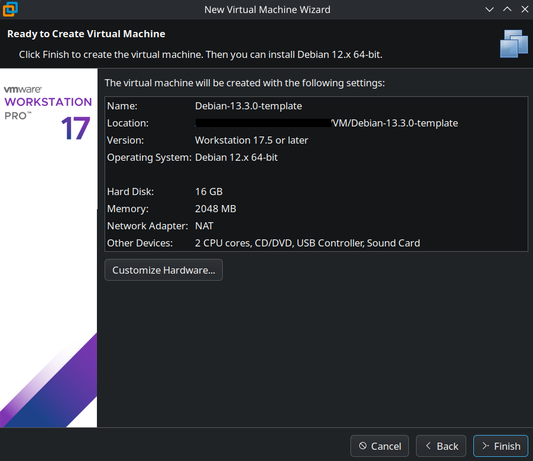

## Configuration Debian 

Pour la configuration on peut faire avec l'interface graphique ou en installation classique, cela ne change pas. Je fais personnellement avec **Install** car je suis plus habitué

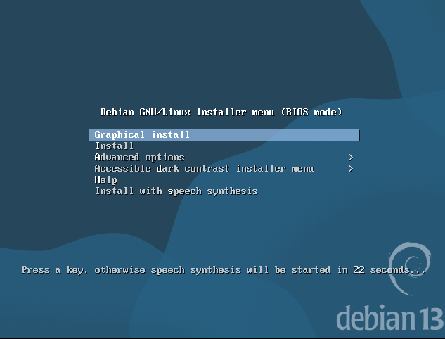

À titre personnel, je met toujours mes machines Linux en anglais car il existe plein de tutos qui sont en anglais et que je préfère (je mets ensuite le clavier en azerty) mais là vous pouvez faire ce que vous voulez 
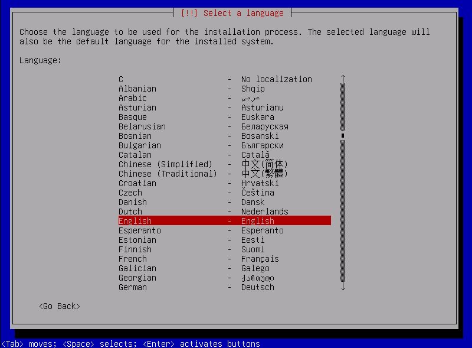

Pour la région j'habite en France, je vais donc mettre France
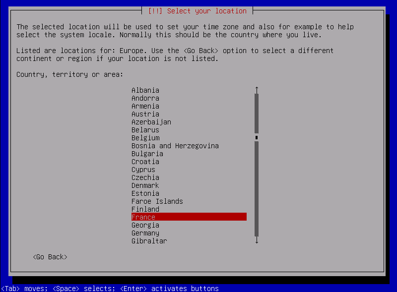

Si vous avez fait comme moi, sélectionnez en LOCALE celle des États-Unis
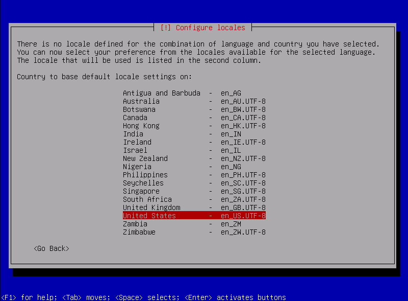

Cela vous demandera ensuite le clavier et là mettez ce que vous préférez 
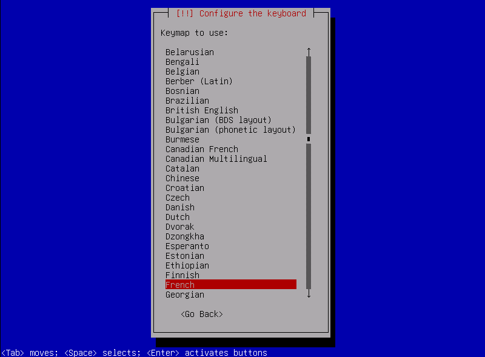

Pour le hostname, il faut toujours mettre un nom parlant, dans mon cas ce sera ``debian-template ``
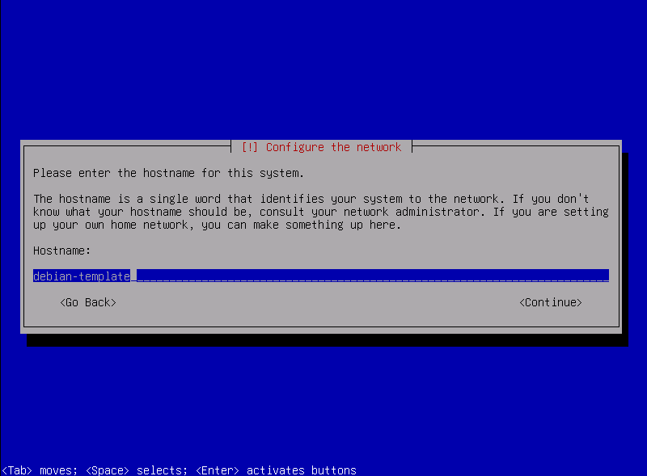

Pour le moment on laisse le domaine à vide
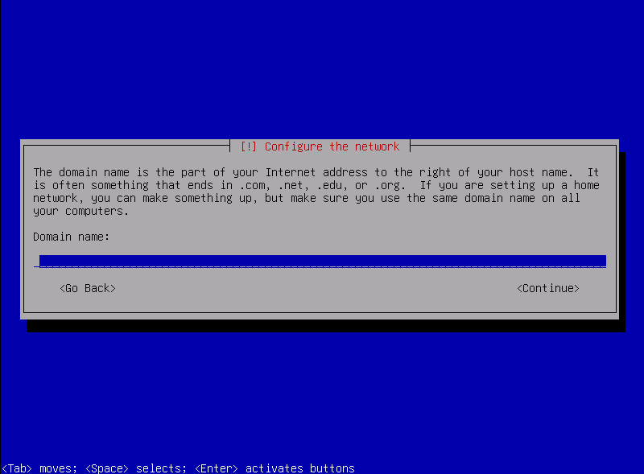

Ceci est un long débat sur comment administrer une machine Linux. Pour moi, il ne faut pas utiliser le compte root, il ne faut donc pas lui donner de mot de passe comme cela, ce sera notre utilisateur qui sera dans le groupe sudo et root n'a pas de mot de passe
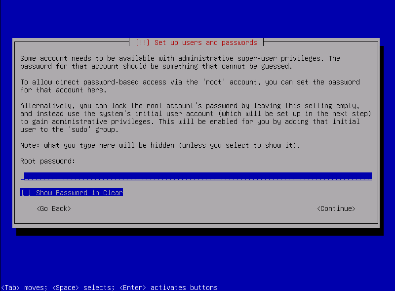

Pour le nom d'utilisateur, nous allons donner un nom qui nous parle beaucoup. Comme j'aime beaucoup le seigneurs des anneaux je vais l'appeler **sauron**. Je rappelle que ceci est un tutoriel à but non-commercial, en entreprise veillez à respecter la charte de l'entreprise si vous ne voulez pas vous faire détruire par votre DSI.
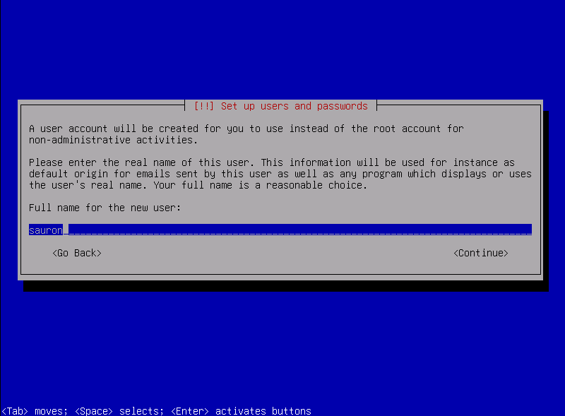

Pour son mot de passe mettez en un, mais on ne vas pas s'en servir beaucoup. Il faut juste qu'il soit assez sécurisées selon l'ANSII (au moins 14 caractères)

Le stockage on ne vas pas le chiffrer car cela pourrait compromettre certaines applications 
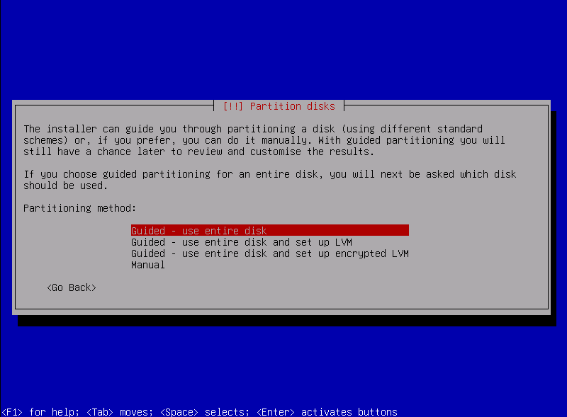

Et pour la répartition, nous sommes un serveur, utilisons la répartition serveur. La répartion "All files in one partition" est très bien aussi et si vous avez peur de mal faire quelque chose, utilisez-la sans soucis. 
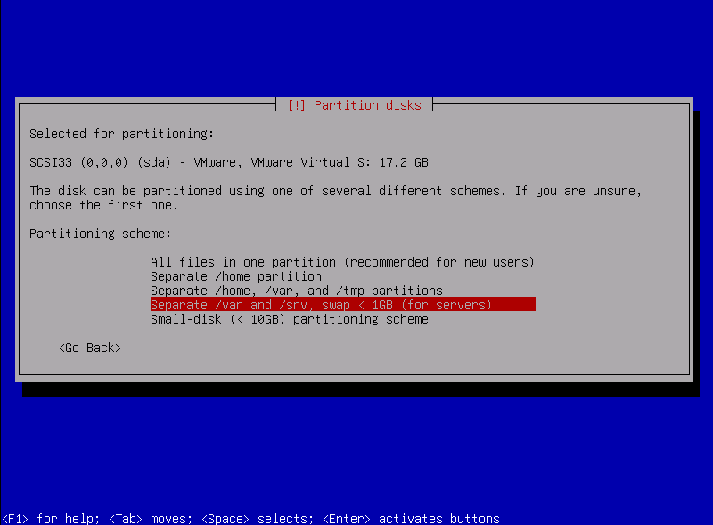

Par la suite n'oubliez pas d'effacer ce qu'il y a sur le disque. Pas de panique, les environnements sont isolés donc aucune donnée privée ne sera effacée

Pas besoin de scanner d'autres medias d'installations, nous allons ensuite utiliser les dépôts apt. Sélectionnez le plus proche de vous pour attendre le moins
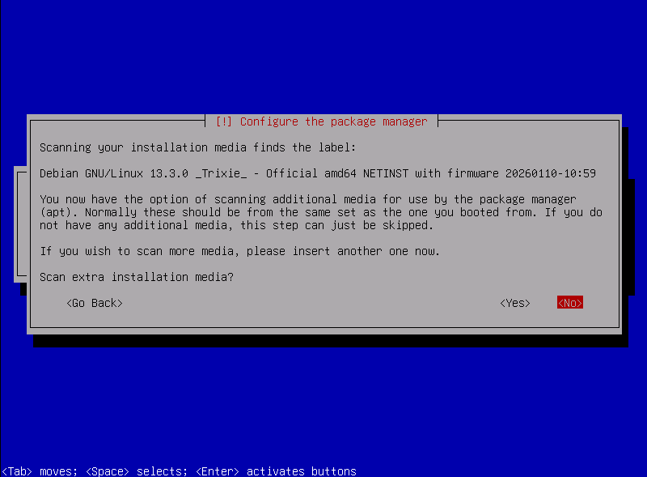

Pour l'usage des paquets il est toujours préférable de le désactiver car cela garde un peu d'anonymat. Très utile quand on veut gérer une infra qui n'est pas publique 
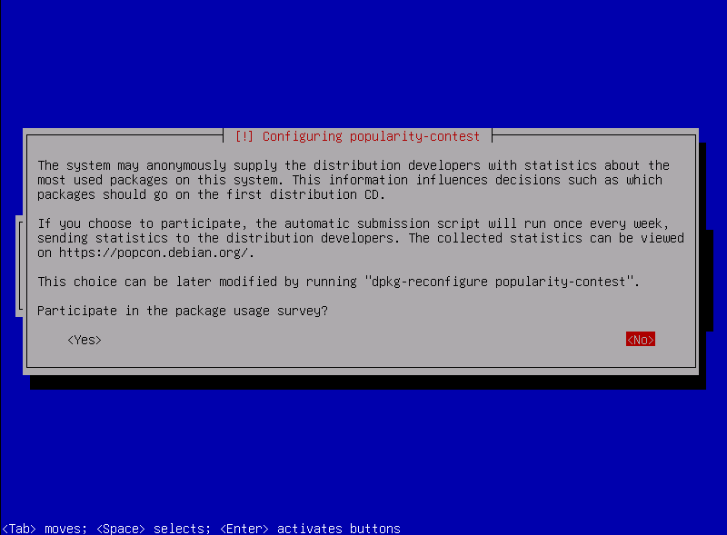

Pour la configuration de base, nous allons juste garder "SSH server" et "standard system utilities" qui vont nous simplifier la vie pour plus tard 
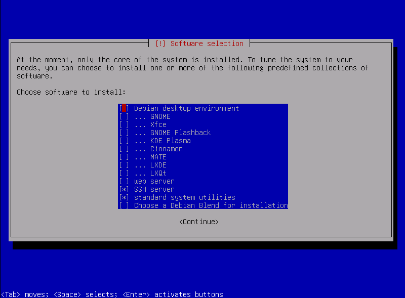

Choississez d'installer grub sur le disque principal et sélectionnez-le, cela fera gagner du temps à chaque démarrage de la VM
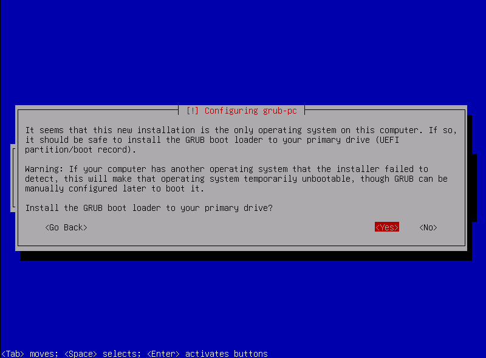

Une fois tout cela fait on peut redémarrer la machine. (Et avoir pris un café en attendant que l'installation se termine)

Une fois la machine redémarrée on fait un update dans le doute pour être sûr d'avoir la dernière version des paquets

```bash
sudo apt update && sudo apt upgrade -y
```

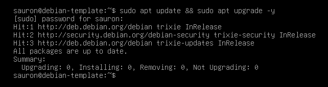

## Configuration de sshd

Maintenant pour simplifier les commandes, nous allons utiliser ssh depuis un terminal pour pouvoir copier les commandes.

Pour se connecter à ssh il nous faut d'abord l'IP de la machine avec la commande ``ip a``

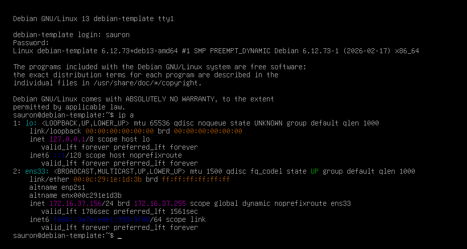

Et on regarde si on peut se connecter avec le mot de passe

```console
$ ssh sauron@172.16.37.156                                           
The authenticity of host '172.16.37.156 (172.16.37.156)' can't be established.
ED25519 key fingerprint is SHA256:VS4y14DFvnqnTrRkuzQAPVqJQGsBxEpDl4TIB8M9Npc.
This key is not known by any other names.
Are you sure you want to continue connecting (yes/no/[fingerprint])? yes
Warning: Permanently added '172.16.37.156' (ED25519) to the list of known hosts.
sauron@172.16.37.156's password: 
Linux debian-template 6.12.73+deb13-amd64 #1 SMP PREEMPT_DYNAMIC Debian 6.12.73-1 (2026-02-17) x86_64

The programs included with the Debian GNU/Linux system are free software;
the exact distribution terms for each program are described in the
individual files in /usr/share/doc/*/copyright.

Debian GNU/Linux comes with ABSOLUTELY NO WARRANTY, to the extent
permitted by applicable law.
sauron@debian-template:~$ 
```

À la première connection on vous mettra cette alerte, c'est normal il faut l'accepter.

### Clé ssh

Se connecter par mot de passe c'est simple mais pas sécurisé. Même si le protocole est chiffré, il vaut mieux utiliser une clé ssh.

Sur la **machine hôte** on va créer une clé ssh avec la commande ssh suivante

```bash
ssh-keygen -t ed25519 -C "infra-admin@cclaudel.fr" -f ~/.ssh/dev_key
```

puis ensuite nous allons ensuite la pousser avec la commande ``ssh-copy-id``

```console
$ ssh-copy-id -i ~/.ssh/dev_key.pub sauron@172.16.37.156
/usr/bin/ssh-copy-id: INFO: Source of key(s) to be installed: "/home/cclaudel/.ssh/dev_key.pub"
/usr/bin/ssh-copy-id: INFO: attempting to log in with the new key(s), to filter out any that are already installed
/usr/bin/ssh-copy-id: INFO: 1 key(s) remain to be installed -- if you are prompted now it is to install the new keys
sauron@172.16.37.156's password: 

Number of key(s) added: 1

Now try logging into the machine, with: "ssh -i /home/cclaudel/.ssh/dev_key 'sauron@172.16.37.156'"
and check to make sure that only the key(s) you wanted were added.
```

Et si on réessaye désormais de se connecter en indiquant la clé privée à utiliser

```
$ ssh -i ~/.ssh/dev_key sauron@172.16.37.156            
Linux debian-template 6.12.73+deb13-amd64 #1 SMP PREEMPT_DYNAMIC Debian 6.12.73-1 (2026-02-17) x86_64

The programs included with the Debian GNU/Linux system are free software;
the exact distribution terms for each program are described in the
individual files in /usr/share/doc/*/copyright.

Debian GNU/Linux comes with ABSOLUTELY NO WARRANTY, to the extent
permitted by applicable law.
Last login: Tue Feb 24 15:40:52 2026 from 172.16.37.1
```

### Configuration ssh

Ce tuto est un peu long je suis d'accord (Et c'est encore plus long pour moi car je dois tout rédiger en faisant le tuto directement)

Mais on s'accroche, cette partie est très longue, mais très importante pour sécurisés son serveur

On va désormais modifier sa configuration pour interdire certaines choses. Sur Debian, le fichier de configuration du serveur est **/etc/ssh/sshd_config**

Dans le fichier il faut décommenter et/ou modifier les informations suivantes

```
LoginGraceTime 2m
PermitRootLogin no
StrictModes yes
MaxAuthTries 3
MaxSessions 2

PasswordAuthentification no
PermitEmptyPasswords no
```

On redémarre ensuite le service ssh pour qu'il aie cette nouvelle configuration

```bash
sudo systemctl restart sshd
```

Si vous pouvez toujours vous connecter avec la clé ssh, bravo vous avez réussi cette étape !

## Sécurisation du serveur

Bien que le serveur ne soit pas exposé directement à internet (en tout cas ceux dans Lan admin), il ne faut pas oublier que la plupart des attaques viennent de l'intérieur du réseau. On va donc rajouter deux outils simples et essentiels pour plus de sécurité :
- nftables: pare feu interne à la machine
- fail2ban: une protection des attaques par brutes forces sur le serveur

### nftabels

#### installation

Pour installer nftables sur la vm, la commande est simple

```bash
sudo apt install nftables -y
```

#### Configuration

Dans la template nous allons ouvrir uniquement le port ssh, le reste n'a pas besoin de communiquer et d'être atteint, ce qui limite la zone d'attaque

La règle SSH doit être active à chaque redémarrage. Pour que ce soit effectif, nous allons changer le fichier de configuration présent /etc/nftables.conf

```conf
#!/usr/sbin/nft -f

# On vide les règles existantes
flush ruleset

table inet filter {
    chain input {
        # Politique par défaut : on bloque tout ce qui entre
        type filter hook input priority 0; policy drop;

        # Autoriser le trafic sur la boucle locale (indispensable au système)
        iif "lo" accept

        # Autoriser le trafic des connexions déjà établies (pour que le serveur puisse répondre)
        ct state established,related accept

        # Autoriser le port SSH (22)
        tcp dport 22 accept
    }

    chain forward {
        # Politique par défaut : on bloque le routage (inutile sauf si c'est un routeur)
        type filter hook forward priority 0; policy drop;
    }

    chain output {
        # Politique par défaut : on autorise tout ce qui sort du serveur
        type filter hook output priority 0; policy accept;
    }
}
```

Puis on n'oublie pas d'enable et de redémarrer le service

```bash
sudo systemctl enable nftables
sudo systemctl restart nftables
```

Des bons moyens de vérifier que cela fonctionne sont d'utiliser les outils ``ss`` et ``nmap``

En local sur le serveur
```console
$ ss -ltun
Netid State  Recv-Q  Send-Q                      Local Address:Port                           Peer Address:Port                         
udp   UNCONN 0       0                           172.16.37.156:68                                  0.0.0.0:*                            
udp   UNCONN 0       0        [fe80::3a7e:e4e1:998:3f06]%ens33:546                                    [::]:*                            
tcp   LISTEN 0       128                               0.0.0.0:22                                  0.0.0.0:*                            
tcp   LISTEN 0       128                                  [::]:22                                     [::]:*
```

Depuis une machine distante (remplacez l'ip par la votre)

```console
$ sudo nmap -sV -p- 172.16.37.156 
Starting Nmap 7.95 ( https://nmap.org ) at 2026-02-24 16:27 CET
Nmap scan report for 172.16.37.156
Host is up (0.00036s latency).
Not shown: 65534 filtered tcp ports (no-response)
PORT   STATE SERVICE VERSION
22/tcp open  ssh     OpenSSH 10.0p2 Debian 7 (protocol 2.0)
MAC Address: 00:0C:29:1E:1D:3B (VMware)
Service Info: OS: Linux; CPE: cpe:/o:linux:linux_kernel

Service detection performed. Please report any incorrect results at https://nmap.org/submit/ .
Nmap done: 1 IP address (1 host up) scanned in 104.66 seconds
```

**Attention** avec nmap, si vous faites du scan de ports sur une machine qui ne vous appartient pas, cela peut vous causer des soucis juridiques car c'est complètement illégal

On n'oublie pas d'essayer dans une nouvelle session de se reconnecter en ssh!

### fail2ban

fail2ban est un standard de la sécurité pour bloquer ce qui parraîtrait un peu trop suspect selon des règles prédéfinies

#### installations

```bash
sudo apt install fail2ban -y
```

#### configuration

Fail2ban peut être très dangereux, on ne compte plus le nombre de personnes qui ont bloqué leur machine avec de fail2ban. Impossible de se connecter en ssh et ils ont du se connecter en physique dessus

on va donc créer une sauvegarde de notre fichier de base avec la commande suivante

```
sudo cp /etc/fail2ban/jail.conf /etc/fail2ban/jail.conf.bck
```

puis ensuite nous alonns créer le fichier ``/etc/fail2ban/jail.local`` avec le contenu suivant

```toml
[DEFAULT]
banaction = nftables-multiport
banaction_allports = nftables-allports


backend = systemd

[sshd]
enabled = true
port    = ssh
filter  = sshd

bantime = 3600
maxretry = 3
```

et puis on redémmare le service

```bash
sudo systemctl restart fail2ban
```

# Conclusion

Avec tout ceci, le serveur Debian a une base très solide. Il faudra faire attention dès qu'on installera un service, qu'on ouvre bien le/les port(s) correspondant(s).